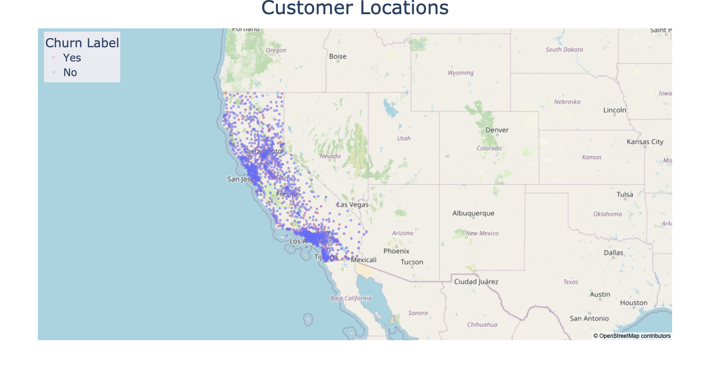

```{r setup, include=FALSE}
knitr::opts_chunk$set(echo = TRUE, comment = NA, fig.pos = "H")
library(reticulate)
```

```{python, include = F}
import pandas as pd
import matplotlib.pyplot as plt
import plotly.express as px
import numpy as np
import seaborn as sns
from wordcloud import WordCloud
from wordcloud import ImageColorGenerator
from wordcloud import STOPWORDS
import matplotlib.patches as mpatches
```

\newpage

# Introduction

Telco, a company providing home internet and phone services, is interested in identifying customers who are at risk of churning. Customers can easily switch from one service provider to the next, making the telecommunications industry highly competitive with an average annual churn rate of 22%. The company has determined that focusing on customer retention rather than acquisition best aligns with their long-term goal of increasing profits. According to their research, acquiring a new customer can cost around 5 times more than retaining an existing customer. Furthermore, even a small increase in customer retention can lead to a large increase in profits. Telco has found that customers are likely to spend more with companies they have already done business with. Furthermore, repeat customers are more likely to refer others, which will support long-term growth.
By identifying customers that are likely to churn, Telco can launch targeted business campaigns to this subset of customers in an effort to increase retention.


```{python, include=F}
data = pd.read_csv("CustomerChurn.csv")
# drop irrelevant features
data.drop(["Count", "Country", "State", "Lat Long", "Churn Score"], axis = 1, inplace = True)
# correct data types
data[["Zip Code", "Churn Value"]] = data[["Zip Code", "Churn Value"]].astype(str)
data[["Total Charges"]] = data[["Total Charges"]].replace(' ','-1000', regex=True)
data[["Total Charges"]] = data[["Total Charges"]].astype(float)
data[["Total Charges"]] = data[["Total Charges"]].replace(-1000,np.nan, regex=True)
#data.info()
#data.nunique()


```


# Exploratory Data Analysis

The data set contains 7043 observations and 33 features. Each observation corresponds to a different customer, whereas the features relate to demographic information of the customers, such as gender, age, and location, as well as the types of services purchased and their cost. Customers are labeled as churned if they have left the business within the last month. Figure 1 shows that Telco customers are located in California and clustered around big cities such as Los Angeles, San Francisco, and San Jose. There also doesn't seem to be any apparent relationship between churn rate and customer location.
\newline


```{python, include=F, }
fig = px.scatter_mapbox(data,lat='Latitude',lon='Longitude', zoom = 4.4, opacity = 0.2, center = dict(lat=37, lon=-115), color = "Churn Label", color_discrete_sequence = ['#EF553B','#636EFA'])
fig.update_layout(mapbox_style="open-street-map", hovermode = False)
fig.update_layout(title = 'Customer Locations', title_x=0.5, title_font = dict(size = 40), legend_font_size = 22, legend = dict(x=0.01,y=0.99, bgcolor = "#EAEAF1"))
fig.write_image('map.png', width = 1500, height = 800)

```




```{python, include=F, fig.cap="\\label{fig:figs}The current churn rate is around 25%."}
sns.set_theme()
sns.set(rc={'figure.figsize':(7,5)})

def without_hue(plot, feature):
    total = len(feature)
    for p in plot.patches:
        percentage = '{:.1f}%'.format(100 * p.get_height()/total)
        x = p.get_x() + p.get_width() / 2 - 0.05
        y = p.get_y() + p.get_height()
        plot.annotate(percentage, (x, y), size = 15)

def with_hue(plot, feature, Number_of_categories, hue_categories):
    a = [p.get_height() for p in plot.patches]
    patch = [p for p in plot.patches]
    for i in range(Number_of_categories):
        total = feature.value_counts().values[i]
        for j in range(hue_categories):
            percentage = '{:.1f}%'.format(100 * a[(j*Number_of_categories + i)]/total)
            x = patch[(j*Number_of_categories + i)].get_x() + patch[(j*Number_of_categories + i)].get_width() / 2 - 0.15
            y = patch[(j*Number_of_categories + i)].get_y() + patch[(j*Number_of_categories + i)].get_height() 
            plot.annotate(percentage, (x, y), size = 12)
    

plot2 = sns.countplot(x="Churn Label", data = data, palette = ['#C97E97','#A6ABF5'])
plt.suptitle("      Churn Percentage", fontsize = 28)
plt.ylabel("Count", fontsize = 22)
plt.xlabel("Churned", fontsize= 22)
plt.xticks(fontsize= 20) 
plt.yticks(fontsize= 20) 
plt.tight_layout()
fig2 = without_hue(plot2, data["Churn Label"])
plt.savefig('fig2.png')
plt.show()
```

\begin{figure}
  \begin{minipage}[t]{0.5\textwidth}
  \hfill\break
        The current churn rate is around 25\%. In other words, approximately 1 out of 4 customers ended up \-cancelling their business with the company (Figure 2), which is quite high. One way of gauging the incurred loss due to churned customers is by estimating their overall value to the company. The customer lifetime value (CLTV) estimates a customer's value and is calculated using corporate formulas and existing data. The higher the value, the more valuable the customer. High value customers should be monitored for churn since they are the most profitabland it costs less to keep existing customers than it does to acquire new ones. 
  \end{minipage}
  \begin{minipage}[t]{0.5\textwidth}\raggedleft
  \raisebox{\dimexpr-\height+\ht\strutbox\relax}{\includegraphics[width=\linewidth]{fig2.png}}
  \caption{The current churn rate is around 25\%.}
  \end{minipage}
\end{figure}
\newpage

Figure 3 displays how the CLTV is distributed among churned and and non-churned customers. 
It also takes into account total number of months that the customer has been with the company. On average, churned customers have a lower life-time value to the company. Furthermore, long-term customers have a higher value and are less likely to churn.

```{python, echo=F, fig.cap = "On average, the estimated CLTV is lower in churned customers. Long-term customers have a higher value and are less likely to churn."}
import warnings
warnings.filterwarnings("ignore")

plt.rcParams["figure.figsize"] = [7.00, 3]
plt.rcParams["figure.autolayout"] = True
fig, ax =plt.subplots(1,2)
sns.boxplot(data= data, y="CLTV", x = "Churn Label", order = ["No", "Yes"], ax = ax[0], palette = ['#A6ABF5','#C97E97'])
sns.scatterplot(data= data, x="Tenure Months", y = "CLTV", hue = "Churn Label", ax = ax[1], alpha = 0.1,palette = ['#EF553B','#636EFA'])
ax[0].set(xlabel = "Churned")
ax[1].legend(loc='upper left', title = 'Churned', prop={'size': 8}, title_fontsize = 8)
fig.suptitle("Distribution of Customer Lifetime Values")
plt.show()

# data.groupby("Churn Label")["Monthly Charges"].sum()
#((data.groupby("Churn Label")["Monthly Charges"].sum())["Yes"])/(data["Monthly Charges"].sum())
```

The data set also contains information on the total monthly charges for each customer. This can be used to calculate the total revenue that is lost due to churned customers. Overall, churned customers constitute around $140,000 in lost revenue, which translates to 30% of total revenue. Figure 4 summarizes the distribution of monthly charges across churned and non-churned customers and indicates that higher monthly charges seem to correlate with higher churn rates.


```{python, echo = F, fig.cap = "Higher monthly charges are correlated with higher churn rates"}
plt.rcParams["figure.figsize"] = [7.00, 3]
plt.rcParams["figure.autolayout"] = True
fig, ax =plt.subplots(1,1)
sns.histplot(data=data, x="Monthly Charges", hue = "Churn Label", palette = ['#EF553B','#636EFA'])
fig.suptitle("Distribution of Monthly Charges Given Churn Status")
ax.set(xlabel = "Monthly Charges ($)")
# add legend
top_bar = mpatches.Patch(color='#A6ABF5', label='No')
bottom_bar = mpatches.Patch(color='#C97E97', label='Yes')
plt.legend(handles=[bottom_bar, top_bar], title = "Churned")
```

\newpage

Total monthly charges are calculated based on different services that a customer is subscribed to. These services involve phone service, internet service, multiple lines, online security, online backup, device protection, and tech support. Figure 5 summarizes the popularity of these services by displaying the number of customers subscribed to them, as well as the churn rate within each service. The majority of customers are subscribed to phone and internet services, whereas tech support and online security are the least popular services. Furthermore, customers that are subscribed to less popular services seem to be less likely to churn.

```{python, include =F}
names = ["Phone Service", "Internet Service", "Multiple Lines", "Online Security", "Online Backup", "Device Protection", "Tech Support"]
vals = []
vals.append((data["Phone Service"].value_counts())["Yes"])
vals.append((data["Internet Service"].value_counts())["Fiber optic"]+(data["Internet Service"].value_counts())["DSL"])
vals.append((data["Multiple Lines"].value_counts())["Yes"])
vals.append((data["Online Security"].value_counts())["Yes"])
vals.append((data["Online Backup"].value_counts())["Yes"])
vals.append((data["Device Protection"].value_counts())["Yes"])
vals.append((data["Tech Support"].value_counts())["Yes"])
neu = pd.DataFrame({'Service': names, 'Number of Subscribers' : vals}).sort_values("Number of Subscribers", ascending = False)

data2 = data[data["Churn Label"]=='Yes']
vals = []
vals.append((data2["Phone Service"].value_counts())["Yes"])
vals.append((data2["Internet Service"].value_counts())["Fiber optic"]+(data["Internet Service"].value_counts())["DSL"])
vals.append((data2["Multiple Lines"].value_counts())["Yes"])
vals.append((data2["Online Security"].value_counts())["Yes"])
vals.append((data2["Online Backup"].value_counts())["Yes"])
vals.append((data2["Device Protection"].value_counts())["Yes"])
vals.append((data2["Tech Support"].value_counts())["Yes"])
neu2 = pd.DataFrame({'Service': names, 'Number of Subscribers' : vals}).sort_values("Number of Subscribers", ascending = False)
```

 
 
```{python, echo=F, results='hide', fig.cap = "The majority of customers are subscribed to phone and internet services. Tech support and online security are the least popular services. Churn rate decreases with popularity."}
plt.rcParams["figure.figsize"] = [7.00, 3]
plt.rcParams["figure.autolayout"] = True
fig, ax =plt.subplots(1,1)
bar1 = sns.barplot(data = neu, y = "Service", x = "Number of Subscribers", orient = 'h', color = '#A6ABF5')
# bar chart 2 -> bottom bars (group of 'Churned=Yes')
bar2 = sns.barplot(x="Number of Subscribers", y="Service", data=neu2, estimator=sum, ci=None,  color='#C97E97')
fig.suptitle('Churn Rate and Popularity of Different Services')
ax.set_xlim(0,7043);

# add legend
top_bar = mpatches.Patch(color='#A6ABF5', label='No')
bottom_bar = mpatches.Patch(color='#C97E97', label='Yes')
plt.legend(handles=[bottom_bar, top_bar], title = "Churned")
plt.show();
```


Customers can choose between three different types of contracts: month-to-month, one year, and two year. In addition, they have the option to opt in to paperless billing choose between different payment methods. Churn rates among different payment related variables are displayed in Figure 6. 

\newpage

```{python, include =F}
# Create df for contracts

names = ["Month-to-month", "Two year", "One year"]
vals = []
vals.append((data["Contract"].value_counts())["Month-to-month"])
vals.append((data["Contract"].value_counts())["Two year"])
vals.append((data["Contract"].value_counts())["One year"])
neu = pd.DataFrame({'Contract Type': names, 'Number of Customers' : vals}).sort_values("Number of Customers", ascending = False)

data2 = data[data["Churn Label"]=='Yes']
vals = []
vals.append((data2["Contract"].value_counts())["Month-to-month"])
vals.append((data2["Contract"].value_counts())["Two year"])
vals.append((data2["Contract"].value_counts())["One year"])
neu2 = pd.DataFrame({'Contract Type': names, 'Number of Customers' : vals}).sort_values("Number of Customers", ascending = False)
```

```{python, include =F}
# Create df for payment method

names = ["Mailed Check", "e-Check", "Bank Transfer", "Credit Card"]
vals = []
vals.append((data["Payment Method"].value_counts())["Mailed check"])
vals.append((data["Payment Method"].value_counts())["Electronic check"])
vals.append((data["Payment Method"].value_counts())["Bank transfer (automatic)"])
vals.append((data["Payment Method"].value_counts())["Credit card (automatic)"])
neu3 = pd.DataFrame({'Payment Method': names, 'Number of Customers' : vals}).sort_values("Number of Customers", ascending = False)

vals = []
vals.append((data2["Payment Method"].value_counts())["Mailed check"])
vals.append((data2["Payment Method"].value_counts())["Electronic check"])
vals.append((data2["Payment Method"].value_counts())["Bank transfer (automatic)"])
vals.append((data2["Payment Method"].value_counts())["Credit card (automatic)"])
neu4 = pd.DataFrame({'Payment Method': names, 'Number of Customers' : vals}).sort_values("Number of Customers", ascending = False)
```

```{python, echo=F, fig.cap = "Long-term contracts have very low churn rates, but are also less popular. Paying with electronic check is the most common and has the highest churn rate."}
plt.rcParams["figure.figsize"] = [7.00, 3]
plt.rcParams["figure.autolayout"] = True
fig, ax = plt.subplots(1,2)

bar1 = sns.barplot(ax = ax[0], data = neu, x = "Contract Type", y = "Number of Customers", color = '#A6ABF5')
bar2 = sns.barplot(ax = ax[0], data=neu2, x = "Contract Type", y = "Number of Customers", estimator=sum, ci=None,  color='#C97E97')
ax[0].tick_params(axis='x', labelrotation= 30)

bar3 = sns.barplot(ax = ax[1], data = neu3, x = "Payment Method", y = "Number of Customers", color = '#A6ABF5')
bar4 = sns.barplot(ax = ax[1], data = neu4, x = "Payment Method", y = "Number of Customers", estimator=sum, ci=None,  color='#C97E97')
ax[1].tick_params(axis='x', labelrotation= 30)

# add legend
top_bar = mpatches.Patch(color='#A6ABF5', label='No')
bottom_bar = mpatches.Patch(color='#C97E97', label='Yes')
fig.legend(handles=[bottom_bar, top_bar], title = "Churned")
fig.suptitle("Churn Rates Across Contract and Payment Types")
plt.show();
```

Month-to-month contracts are the most popular option and are associated with the highest churn rates. On the other hand, long-term contracts are less popular but have a very low churn rate. Most customers pay via electronic check, which has a higher churn rate than other payment methods.
\newline

Demographic information on the customers include whether they are a senior citizen, have dependents, or have a partner, as well as their gender. Figure 7 plots churn rates by taking into account demographic information.

```{python, include =F}
# Create df for Gender

names = ["Male", "Female"]
vals = []
vals.append((data["Gender"].value_counts())["Male"])
vals.append((data["Gender"].value_counts())["Female"])
neu = pd.DataFrame({'Gender': names, 'Number of Customers' : vals}).sort_values("Number of Customers", ascending = False)

data2 = data[data["Churn Label"]=='Yes']
vals = []
vals.append((data2["Gender"].value_counts())["Male"])
vals.append((data2["Gender"].value_counts())["Female"])
neu2 = pd.DataFrame({'Gender': names, 'Number of Customers' : vals}).sort_values("Number of Customers", ascending = False)
```

```{python, include =F}
# Create df for Demographic

names = ["Senior", "Dependents", "Partner"]
vals = []
vals.append((data["Senior Citizen"].value_counts())["Yes"])
vals.append((data["Dependents"].value_counts())["Yes"])
vals.append((data["Partner"].value_counts())["Yes"])
neu3 = pd.DataFrame({'Other Attributes': names, 'Number of Customers' : vals}).sort_values("Number of Customers", ascending = False)

vals = []
vals.append((data2["Senior Citizen"].value_counts())["Yes"])
vals.append((data2["Dependents"].value_counts())["Yes"])
vals.append((data2["Partner"].value_counts())["Yes"])
neu4 = pd.DataFrame({'Other Attributes': names, 'Number of Customers' : vals}).sort_values("Number of Customers", ascending = False)
```


```{python, echo=F, fig.cap = "Churn rates do not differ between genders. Customers with dependents have a comparatively low churn rate."}
plt.rcParams["figure.figsize"] = [7.00, 3]
plt.rcParams["figure.autolayout"] = True
fig, ax = plt.subplots(1,2)

bar1 = sns.barplot(ax = ax[0], data = neu, x = "Gender", y = "Number of Customers", color = '#A6ABF5')
bar2 = sns.barplot(ax = ax[0], data=neu2, x = "Gender", y = "Number of Customers", estimator=sum, ci=None,  color='#C97E97')

bar3 = sns.barplot(ax = ax[1], data = neu3, x = "Other Attributes", y = "Number of Customers", color = '#A6ABF5')
bar4 = sns.barplot(ax = ax[1], data = neu4, x = "Other Attributes", y = "Number of Customers", estimator=sum, ci=None,  color='#C97E97')
ax[1].tick_params(axis='x', labelrotation= 0)

# add legend
top_bar = mpatches.Patch(color='#A6ABF5', label='No')
bottom_bar = mpatches.Patch(color='#C97E97', label='Yes')
fig.legend(handles=[bottom_bar, top_bar], title = "Churned")
fig.suptitle("Churn Rates Across Demographic Information")
plt.show();
```

There are a roughly equal number of male and female customers. The churn rate does not differ significantly between the two genders. Furthermore, customers with dependents have a relatively low churn rate. 

\newpage

```{python, include=F, fig.cap="\\label{fig:figs}The most common churn reasons can be attributed to competitors and negative customer support experiences"}
# transfor text data
texdata = data[~data["Churn Reason"].isnull()]["Churn Reason"]

sns.set(rc={'figure.figsize':(7,5)})

fig, ax =plt.subplots(1,1)
text = " ".join(i for i in texdata)
stopwords = set(STOPWORDS)
wordcloud = WordCloud(collocations=False,stopwords=stopwords, background_color="white").generate(text)
plt.imshow(wordcloud, interpolation='bilinear')
plt.axis("off")
plt.suptitle("Churn Reason", fontsize = 30)
plt.tight_layout()
plt.savefig('fig6.png')
```

\begin{figure}
  \begin{minipage}[t]{0.5\textwidth}
  \hfill\break    
        A simple way of gaining insight into why customers are churning is by asking them directly. Telco records the responses to a survey that asks customers who are cancelling their services about the specific reason for leaving.\\
        \\
        Figure 8 visualizes the most common words from these customer surveys by generating a word cloud, where a larger font size corresponds to a higher frequency of the word. Overall, the most common churn reason can be attributed to competitors. Other words that stand out, such as support and attitude, suggest that negative customer support experiences are another frequent churn reason.
  \end{minipage}
  \begin{minipage}[t]{0.5\textwidth}\raggedleft
  \raisebox{\dimexpr-\height+\ht\strutbox\relax}{\includegraphics[width=\linewidth]{fig6.png}}
  \caption{Most customers churn due to competitors and negative customer support experiences.}
  \end{minipage}
\end{figure}

The "Total Charges" feature has 11 observations with missing values. These observations correspond to customers that have a tenure of less than a month. Since churn values are established for customers that churned within the last month, the best way to deal with these observations is to drop them.


```{python, echo=F}
data =data[data["Tenure Months"] != 0]
```

The heatmap in Figure 9 describes the correlation among the four quantitative features in the data set. Since total charges are calculated as the monthly charges times the tenure, it is no surprise that they are highly correlated.

```{python, echo=F, fig.cap = "Total charges are highly correlated with tenure and monthly charges.", results = 'hide'}
plt.rcParams["figure.figsize"] = [7.00, 3]
plt.rcParams["figure.autolayout"] = True
fig, ax =plt.subplots(1,1)
yolo= sns.color_palette("light:b", as_cmap=True)
sns.heatmap(data=data[['Tenure Months', 'CLTV', 'Total Charges', 'Monthly Charges']].corr(),
            annot=True, cmap=yolo, linewidth = 1)
plt.xticks(fontsize= 8) 
plt.yticks(fontsize= 8)
        
fig.suptitle('Correlation of Quantitative Features')
plt.show();
```


# Modeling

```{python, echo=F}
from sklearn.model_selection import train_test_split
from sklearn.preprocessing import OneHotEncoder
from imblearn.over_sampling import SMOTE

# create x and y
x = data.drop(["CustomerID", "City", "Zip Code", "Latitude", "Longitude", "Churn Label","Churn Reason", "Churn Value"], axis = 1).copy()
y = data["Churn Value"].copy()
y = y.astype('int')
# train test split
X_train, X_test, y_train, y_test = train_test_split(x,y, train_size = 0.8, random_state = 123, stratify = y)

# new dimension sanity check
#X_train.info()
#y_train.info()
#X_test.info()
#y_test.info()

# One hot encode categorical features
ohe = OneHotEncoder(handle_unknown = 'error')
encoded_train = ohe.fit_transform(X_train.select_dtypes(include = "object")).toarray()
feature_labels = ohe.get_feature_names()
feature_labels = np.array(feature_labels).ravel()
X_trainCat = pd.DataFrame(encoded_train, columns = feature_labels)

encoded_test = ohe.transform(X_test.select_dtypes(include = "object")).toarray()
X_testCat = pd.DataFrame(encoded_test, columns = feature_labels)

# Merge with quant features
X_train =  X_train.reset_index(drop = True)
X_test = X_test.reset_index(drop = True)
X_trainFull = pd.concat([X_trainCat, X_train.select_dtypes(include = "number")], axis = 1)
X_testFull = pd.concat([X_testCat, X_test.select_dtypes(include = "number")], axis = 1)
```

Most machine learning models don't natively support non-numeric data. Hence, all categorical features are manually transformed into dummy variables via one-hot-encoding prior to being used as input for modeling. In addition, uninformative features such as Customer ID, Country, and State  are dropped. This results in a new data frame with dimensions 7032 x 47.

Another thing to consider before training models is that there exists an unequal proportion of churned and non-churned customers in the data set, which will negatively impact prediction performance of the minority class. Synthetic Minority Over-Sampling Technique (SMOTE) is used to address this issue and create a more balanced data set.

Different classification models are used to predict churning customers. These include tree ensembles such as Random Forests and XGBoost, as well as other parametric models such as Logistic Regression and Logistic Elastic Net. Classification results are summarized in figures 10 to 13. Each figure is comprised of a table of performance metrics on and a confusion matrix, where 1 represents churned customers and 0 represents non-churned customers.

```{python, echo=F, results = 'hide'}
### Hyperparam tuning
from sklearn.model_selection import GridSearchCV
from sklearn.ensemble import RandomForestClassifier
from sklearn import metrics
from sklearn.metrics import plot_confusion_matrix, make_scorer
# Create a search grid of parameters that will be shuffled through
param_grid = {'max_depth': [20,40,80],'min_samples_leaf': [1,4],'n_estimators': [100,200, 400, 500, 1000]}

scorer = make_scorer(metrics.recall_score,pos_label = 1)
# train and predict
rf_classifier = RandomForestClassifier(random_state = 123)

# Using the random grid and searching for best hyperparameters

rf_gr = GridSearchCV(estimator = rf_classifier, param_grid = param_grid, cv = 5, n_jobs = -1, scoring = scorer)

rf_gr.fit(X_trainFull, y_train) #fit is to initiate training process
rf_classifier.fit(X_trainFull, y_train)
y_pred = rf_gr.predict(X_testFull)
```

```{python, echo = F, results= 'hide', fig.cap= 'Random Forests: High Accuracy, low Recall.'}


df = pd.DataFrame({'Metric': ['Accuracy','Precision', 'Recall', 'F1-Beta'],'Score': [round(metrics.accuracy_score(y_test, y_pred),3), round(metrics.precision_score(y_test, y_pred),3),round(metrics.recall_score(y_test, y_pred),3),round(metrics.fbeta_score(y_test, y_pred, beta= 0.75),3)]})

plt.rcParams["figure.figsize"] = [7.00, 3]
plt.rcParams["figure.autolayout"] = True
plt.rcParams["xtick.labeltop"] = True
plt.rcParams["xtick.labelbottom"] = False
plt.rcParams["axes.grid"] = False

fig = plt.figure()
ax1 = fig.add_subplot(121)
ax2 = fig.add_subplot(122)
plot_confusion_matrix(rf_gr, X_testFull, y_test, cmap = yolo, labels = [1,0], colorbar = False, ax= ax2)
plt.title('Predicted')
plt.ylabel('Actual')
plt.xlabel('')
plt.suptitle('Random Forests')

bbox = [0, 0, 1, 1]
ax1.axis('off')
mpl_table = ax1.table(cellText=df.values, bbox=bbox, colLabels=df.columns)
plt.show()

```

```{python, echo=F, results = 'hide'}
# scale_pos_weight adds penalty to incorrectly classifying minority class
import xgboost as xgb

param_grid = {'max_depth': [3,4,5], 'learning_rate':[0.01],'reg_lambda':[10,30],'scale_pos_weight': [1,3,5], 'n_estimators': [50]}

xgb_classifier = xgb.XGBClassifier(objective='binary:logistic', eval_metric='aucpr')
xgb_gr = GridSearchCV(estimator = xgb_classifier, param_grid = param_grid, cv = 5, n_jobs = -1, scoring = scorer)
#xgb_classifier.fit(X_trainFull, y_train) 
xgb_gr.fit(X_trainFull, y_train)
y_pred = xgb_gr.predict(X_testFull)
```

```{python, echo = F, results= F, fig.cap= 'XGBoost: Low Accuracy, high Recall.'}
df = pd.DataFrame({'Metric': ['Accuracy','Precision', 'Recall', 'F1-Beta'],'Score': [round(metrics.accuracy_score(y_test, y_pred),3), round(metrics.precision_score(y_test, y_pred, pos_label =1),3),round(metrics.recall_score(y_test, y_pred, pos_label = 1),3),round(metrics.fbeta_score(y_test, y_pred, pos_label = 1, beta= 0.75),3)]})

fig = plt.figure()
ax1 = fig.add_subplot(121)
ax2 = fig.add_subplot(122)
plot_confusion_matrix(xgb_gr, X_testFull, y_test, cmap = yolo, labels = [1,0], colorbar = False, ax= ax2)
plt.title('Predicted')
plt.ylabel('Actual')
plt.xlabel('')
plt.suptitle('XGBoost')

bbox = [0, 0, 1, 1]
ax1.axis('off')
mpl_table = ax1.table(cellText=df.values, bbox=bbox, colLabels=df.columns)
plt.show()

#plot 1 tree and feature importance
```

```{python, echo =F, results = 'hide'}
from sklearn.linear_model import LogisticRegressionCV
logi_classifier = LogisticRegressionCV(cv=5, class_weight = 'balanced')
elastic_net_classifier = LogisticRegressionCV(cv=5, penalty='elasticnet', l1_ratios=[0.1, 0.5, 0.9], solver='saga', class_weight = 'balanced' , n_jobs = -1)
logi_classifier.fit(X_trainFull, y_train)
elastic_net_classifier.fit(X_trainFull, y_train)
y_pred1 = logi_classifier.predict(X_testFull)
y_pred2 = elastic_net_classifier.predict(X_testFull)
df1 = pd.DataFrame({'Metric': ['Accuracy','Precision', 'Recall', 'F1-Beta'],'Score': [round(metrics.accuracy_score(y_test, y_pred1),3), round(metrics.precision_score(y_test, y_pred1, pos_label =1),3),round(metrics.recall_score(y_test, y_pred1, pos_label = 1),3),round(metrics.fbeta_score(y_test, y_pred1, pos_label = 1, beta= 0.75),3)]})
df2 = pd.DataFrame({'Metric': ['Accuracy','Precision', 'Recall', 'F1-Beta'],'Score': [round(metrics.accuracy_score(y_test, y_pred2),3), round(metrics.precision_score(y_test, y_pred2, pos_label =1),3),round(metrics.recall_score(y_test, y_pred2, pos_label = 1),3),round(metrics.fbeta_score(y_test, y_pred2, pos_label = 1, beta= 0.75),3)]})

```

```{python, echo = F, results = 'hide', fig.cap= 'Logistic Regression: Medium Accuracy, medium Recall.'}
fig = plt.figure()
ax1 = fig.add_subplot(121)
ax2 = fig.add_subplot(122)
plot_confusion_matrix(logi_classifier, X_testFull, y_test, cmap = yolo, labels = [1,0], colorbar = False, ax= ax2)
plt.title('Predicted')
plt.ylabel('Actual')
plt.xlabel('')
plt.suptitle('Logistic Regression')

bbox = [0, 0, 1, 1]
ax1.axis('off')
mpl_table = ax1.table(cellText=df1.values, bbox=bbox, colLabels=df1.columns)
plt.show()
```

```{python, echo = F, results = 'hide', fig.cap= 'Logistic Elastic Net: Medium Accuracy, medium Recall.'}
fig = plt.figure()
ax1 = fig.add_subplot(121)
ax2 = fig.add_subplot(122)
plot_confusion_matrix(elastic_net_classifier, X_testFull, y_test, cmap = yolo, labels = [1,0], colorbar = False, ax= ax2)
plt.title('Predicted')
plt.ylabel('Actual')
plt.xlabel('')
plt.suptitle('Logistic Elastic Net')

bbox = [0, 0, 1, 1]
ax1.axis('off')
mpl_table = ax1.table(cellText=df2.values, bbox=bbox, colLabels=df2.columns)
plt.show()
```


# Results

All models face a trade-off between Type I and Type II error. It is important to carefully consider this trade-off and the business implications when deciding on an evaluation metric. A Type I error occurs when a customer is falsely predicted to churn. On the other hand, a Type II error occurs when a customer is falsely predicted not to churn.

For Telco, this means that a Type II error would result in targeting non-churning customers with campaigns directed at churning customers. Although this could have negative consequences in the long-run, it is arguably more desirable than failing to identify churning customers. Thus, models with low Type I error are preferred over models with low Type II error.

For this reason, performance metrics such as Recall and the F1-beta score are preferred over Accuracy. Recall, sometimes referred to as Sensitivity or True Positive Rate, measures the fraction of actual churned customers that were correctly classified. The F1-beta score uses a weighted approach to strike a balance between Recall and Precision, where Precision measures the fraction of churned predictions that are actual churned customers. 

Table X summarizes the model results and indicates that X algorithm performs the best when measured by Recall and F1-beta score. 

Assuming that the target campaigns have a 50% effectiveness ....

```{r, eval=F}
library(dplyr)
library(kableExtra)
kable(py$df, digits=2)%>%
  kable_styling(font_size = 12, latex_options = "hold_position")%>%
  row_spec(0, bold = TRUE)%>%
  kableExtra::pack_rows("Baseline", 1,1 )%>%
  kableExtra::pack_rows("Top 3 SARIMA", 3,3 )
```


# Conclusion

Summarized the findings of the report. How this will benefit people. Where future research could go.